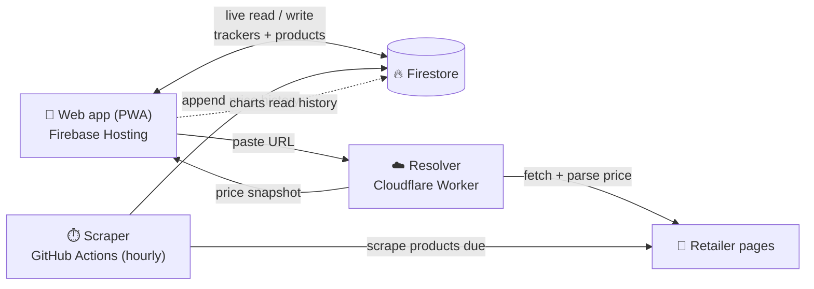

<p align="center">
  
</p>

<h1 align="center">PricePilot</h1>

<p align="center">
  <b>Track any product's price across the web — and never overpay again.</b>
</p>

<p align="center">
  <a href="https://pricepilot.web.app"><b>🚀 Live app → pricepilot.web.app</b></a>
</p>

<p align="center">
  
  
  
  
  
</p>

---

## Overview

**PricePilot** is a mobile-first, installable price-tracking app (PWA). Paste a product link
from almost any online store — Amazon, Flipkart, Myntra, Best Buy, and more — and PricePilot
resolves the current price, watches it around the clock, and charts its history over time so
you know the *right* moment to buy.

It's built to run **entirely on free tiers** (Firebase Spark, Cloudflare Workers, GitHub Actions)
with no paid backend — a deliberate constraint that shaped the whole architecture.

- 🎯 **Track** any product URL and set a target price
- 📉 **Get insights** — price drops, potential savings, all-time low/high
- 📈 **See history** — continuous, hourly price charts per product
- 🏷️ **Know the store** — every product shows its real retailer logo
- 💜 **Wishlist** things you're not ready to track yet
- 📱 **Install it** — works offline, lives on your home screen like a native app

---

## Features

### 🏠 Dashboard
- At-a-glance stat cards: **Tracked**, **Price drops**, **Alerts**, **Targets met** — each with real
  derived context (total tracked value, average discount, ratios).
- **Price Insights** — a potential-savings figure (sum of all current drops) and a compact weekly
  trend sparkline for your biggest deal.
- **Deals Today** — a horizontally-scrollable carousel of products currently at a discount.
- **Active alerts** — cards showing current vs. target price with a live progress bar.
- Quick **Track a product** and **Recent price drops** tiles.

### ➕ Tracking a product
- Paste any product URL — a **resolver** pulls the title, image, current price, discount, and store.
- **One-tap track** from a popup, or the full **Add** flow to also set a **target price**.
- Products are **deduplicated** by URL, so the same item tracked by multiple users shares one
  scrape target.

### 📊 Charts
- Per-product **price history** with a smooth area chart and hover tooltips.
- Range selector: **1W / 1M / 3M / 6M / 1Y / All**.
- Stats: **lowest**, **average**, **highest**, plus a **change %** pill.
- A **price-drops timeline** of every recorded drop in the range.
- Compact **dropdown picker** to switch between tracked products.

### 🏷️ Retailer badges
- Every product displays its **store's real favicon logo** (Amazon, Flipkart, Myntra, Nykaa, AJIO,
  Best Buy, Walmart, Target, and ~20 more), with a brand-colored monogram fallback when offline.

### 🛍️ Products & 💜 Wishlist
- **Products** — search and manage everything you track; toggle alerts, open at the retailer, or
  stop tracking (with a confirmation dialog).
- **Wishlist** — save products *without* tracking them, then promote any to a tracked product in
  one tap.

### ⚙️ Settings
- Profile with a **permanent, globally-unique username** and your **Google account photo**.
- Notification preferences (email / web push toggles).
- **Install app** (PWA) prompt, account info, and sign-out.

### 🎨 Experience
- Premium **near-black + cyan** dark theme with subtle, tasteful animations.
- **Google Sign-In** only — no passwords to manage.
- **Installable PWA** with an offline app shell and a branded splash screen.
- Confirmation dialogs on every destructive action.

---

## How it works

Because Firebase's free (Spark) plan has **no server-side compute** (no Cloud Functions), PricePilot
splits its "backend" across two tiny, free, stateless pieces:



1. **Resolver (Cloudflare Worker)** — browsers can't fetch cross-origin retailer pages (CORS), so a
   stateless worker fetches the page server-side and extracts a price snapshot (via JSON-LD,
   OpenGraph, or a dedicated Amazon adapter). It never touches the database.
2. **Client writes** — the app itself creates the `product` and `tracker` documents in Firestore
   after previewing the snapshot.
3. **Scraper (GitHub Actions)** — a Node job runs **hourly** on a cron schedule, finds products due
   for a check, scrapes their current price, and appends a point to each product's history. This is
   what makes the charts a **continuous** trace. A failed read never overwrites a known-good price.

Everything the user sees updates **live** via Firestore's realtime listeners.

---

## Tech stack

| Layer | Technology |
|-------|------------|
| **Frontend** | React 19 · React Router 7 · TanStack Query 5 · Recharts 3 · Tailwind CSS v4 · Vite 5 · `vite-plugin-pwa` |
| **Auth & data** | Firebase Auth (Google) · Cloud Firestore · Firebase Hosting |
| **Resolver** | Cloudflare Worker (TypeScript, Wrangler) |
| **Scraper** | Node 22 · `firebase-admin` · `tsx` · GitHub Actions (scheduled) |
| **Shared** | TypeScript + **Zod** schemas (single source of truth for the whole monorepo) |
| **Tooling** | npm workspaces monorepo · Vitest · TypeScript 5 |

---

## Monorepo structure

```
PricePilot/
├── apps/
│   └── web/            # React PWA — the app users see (Firebase Hosting)
├── workers/
│   └── resolver/       # Cloudflare Worker — fetches + parses a product URL
├── services/
│   └── scraper/        # Node job — hourly price scrape (GitHub Actions)
├── packages/
│   └── shared/         # Zod schemas + shared utils (types, URL/price helpers)
├── docs/               # Full product & architecture blueprint
├── firestore.rules     # Firestore security rules
└── .github/workflows/  # scrape.yml — the hourly price-scrape cron
```

---

## Getting started

### Prerequisites
- **Node.js 22+**
- A **Firebase** project (Auth + Firestore + Hosting on the free Spark plan is enough)
- *(optional)* A **Cloudflare** account to deploy your own resolver worker

### 1. Install
```bash
git clone https://github.com/vabxsen/PricePilot.git
cd PricePilot
npm install
```

### 2. Configure
```bash
cp .env.example .env.local
```
Fill in your Firebase web config and resolver URL:

| Variable | Purpose |
|----------|---------|
| `VITE_FIREBASE_*` | Your Firebase web app config (API key, project ID, etc.) |
| `VITE_RESOLVER_URL` | URL of your deployed resolver worker |
| `VITE_USE_EMULATORS` | `true` to use the local Firebase emulators |
| `FIREBASE_SERVICE_ACCOUNT` | Service-account JSON — used **only** by the scraper (never the client) |

### 3. Run
```bash
npm run dev            # web app (Vite dev server)
npm run resolver:dev   # resolver worker (Wrangler)
npm run emulators      # Firebase Auth + Firestore emulators
```

### Useful scripts
| Command | What it does |
|---------|--------------|
| `npm run build` | Type-check + build the web app |
| `npm run test` | Run the Vitest suites |
| `npm run typecheck` | Type-check every workspace |
| `npm run scrape` | Run the price scraper once (needs `FIREBASE_SERVICE_ACCOUNT`) |
| `npm run deploy:web` | Build + deploy the web app to Firebase Hosting |

---

## Deployment

- **Web app** → Firebase Hosting: `npm run deploy:web`
- **Resolver** → Cloudflare Workers: `npm run deploy -w @pricepilot/resolver` (via Wrangler)
- **Scraper** → runs automatically **hourly** via GitHub Actions
  ([`.github/workflows/scrape.yml`](.github/workflows/scrape.yml)). It needs a
  `FIREBASE_SERVICE_ACCOUNT` repository secret (the service-account JSON) to write to Firestore.

---

## Data model (Firestore)

| Collection | What it holds |
|------------|---------------|
| `users/{uid}` | Profile, unique username, plan, notification prefs |
| `products/{id}` | Canonical, deduped scrape target — current price, image, retailer, all-time low/high |
| `products/{id}/history/{autoId}` | Append-only price points (the chart data) |
| `users/{uid}/trackers/{id}` | A user's link to a product + their target price & alert settings |
| `users/{uid}/wishlist/{id}` | Saved-but-not-tracked products |

All schemas live in [`packages/shared`](packages/shared) as **Zod** models — the single source of
truth shared by the app, resolver, and scraper.

---

## Roadmap / known limitations

- 🔔 **Notification delivery** — the email / web-push preference toggles are wired to the database,
  but *delivery* isn't implemented yet (Spark has no server to send from). Planned via the scraper +
  a transactional email provider.
- 🌐 **Cloud scraping limits** — some large retailers block automated requests from datacenter IPs,
  so a few products may only resolve reliably from a residential connection.
- 📊 More insights: forecasts, deal scores, and cross-store comparison.

---

## Documentation

The [`docs/`](docs) folder holds the full product & engineering blueprint:

| Doc | What's inside |
|-----|---------------|
| [`00-product-vision.md`](docs/00-product-vision.md) | Vision, personas, user flows |
| [`01-design-system.md`](docs/01-design-system.md) | Branding, design tokens, UI system |
| [`02-frontend.md`](docs/02-frontend.md) | Frontend architecture |
| [`03-backend.md`](docs/03-backend.md) | Services, APIs, scheduling |
| [`04-data.md`](docs/04-data.md) | Data model & lifecycle |
| [`05-platform.md`](docs/05-platform.md) | Auth, security, infra, CI/CD |
| [`06-roadmap.md`](docs/06-roadmap.md) | Milestones & build order |
| [`07-spark-mvp.md`](docs/07-spark-mvp.md) | The free-tier MVP this repo actually ships |

---

<p align="center">
  Made with 💜 by <b>Vaibhav Sen</b> · Made in India 🇮🇳
</p>
